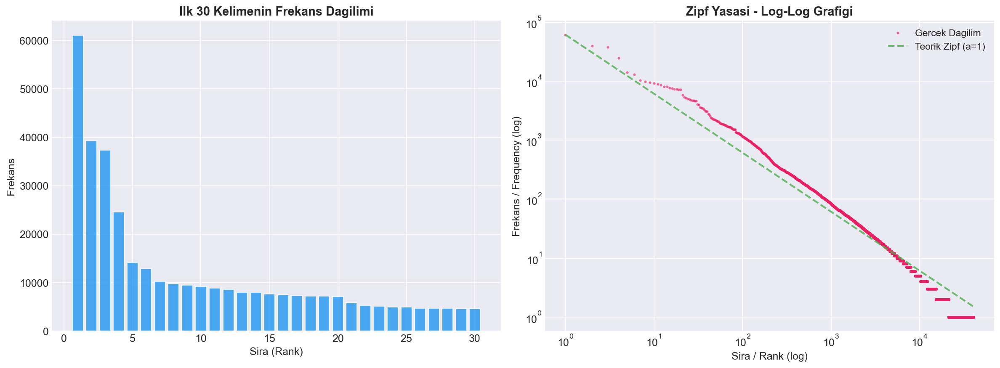

# 📖 Kutsal Kitaplar Metin Analizi — NLP Preprocessing & Zipf Yasası

Bu proje, **Kuran**, **İncil** ve **Tevrat** kutsal kitaplarının İngilizce çeviri metinleri üzerinde doğal dil işleme (NLP) ön işleme adımlarını ve Zipf Yasası analizini gerçekleştirmektedir.

---

## 📋 İçindekiler

- [Proje Hakkında](#-proje-hakkında)
- [Veri Setleri](#-veri-setleri)
- [Kurulum](#-kurulum)
- [Proje Yapısı](#-proje-yapısı)
- [İşlem Adımları](#-işlem-adımları)
- [Çıktı Dosyaları](#-çıktı-dosyaları)
- [Zipf Yasası](#-zipf-yasası)
- [Kullanılan Teknolojiler](#-kullanılan-teknolojiler)

---

## 🎯 Proje Hakkında

Bu proje, üniversite final ödevi kapsamında hazırlanmıştır. Üç büyük kutsal kitabın İngilizce çeviri metinleri üzerinde:

1. **Zipf Yasası** analizi yapılarak doğal dil dağılımları incelenmiştir.
2. **Metin ön işleme** (preprocessing) adımları sistematik olarak uygulanmıştır.
3. İleride **model eğitimi** için kullanılabilecek temiz CSV dosyaları üretilmiştir.

---

## 📊 Veri Setleri

### Kaynaklar

| Veri Seti | Kaynak | Dosya Boyutu |
|-----------|--------|-------------|
| **Kuran** (Quran) | [Kaggle — The Quran Dataset](https://www.kaggle.com/datasets/imrankhan197/the-quran-dataset?select=The+Quran+Dataset.csv) | 4 MB |
| **İncil & Tevrat** (Bible) | [GitHub — Bible Data (AlamoPolyglot)](https://github.com/BradyStephenson/bible-data/blob/main/AlamoPolyglot.csv) | 29.4 MB |

### Veri Seti Detayları

| Veri Seti | Açıklama | Ayet Sayısı |
|-----------|----------|-------------|
| **Kuran** | 114 sure, 30 cüz | 6.236 |
| **İncil** | Bible veri setinden `book_id >= 6` olan kayıtlar | 25.250 |
| **Tevrat** | Bible veri setinden `book_id < 6` olan kayıtlar (Genesis, Exodus, Leviticus, Numbers, Deuteronomy) | 5.852 |
| **Toplam** | Birleştirilmiş veri seti | **37.338** |

### Ortak Sütun Yapısı

Tüm veri setleri aşağıdaki ortak yapıya dönüştürülmüştür:

| Sütun | Tip | Açıklama |
|-------|-----|----------|
| `sure_no` | int | Sure/Kitap numarası |
| `sure_ismi` | str | Sure/Kitap adı (ör: Al-Fatihah, Genesis, Joshua) |
| `bolum` | int | Bölüm numarası (Kuran: Cüz no, İncil/Tevrat: Chapter no) |
| `ayet_no` | int | Ayet numarası |
| `kaynak` | str | Veri seti kaynağı (Kuran / İncil / Tevrat) |
| `ayet` | str | Ayet metni (İngilizce) |

---


## 📁 Proje Yapısı

```
├── analiz.ipynb              # Ana analiz notebook'u (Zipf + Preprocessing)
├── README.md                 # Bu dosya
│
├── data/                     # Ham veri dosyaları
│   ├── quran.csv             # Kuran veri seti (Kaggle)
│   ├── bible.csv             # Bible veri seti (GitHub)
│   ├── tevrat.csv            # Tevrat (Bible'dan ayrıştırılmış, book_id < 6)  
│
├── ham_veri.csv              # Temizlenmemiş, orijinal birleşik veri
├── stemmed_veri.csv          # Stemming uygulanmış veri
├── lemmatized_veri.csv       # Lemmatization uygulanmış veri
└── zipf_yasasi.png           # Zipf Yasası log-log grafiği
```

---

## 🔧 İşlem Adımları

Notebook'ta aşağıdaki adımlar sırasıyla uygulanmıştır. Her adımdan sonra verinin **önceki** ve **sonraki** hali karşılaştırmalı olarak gösterilmektedir.

### 1. Veri Yükleme ve Raporlama
- Üç veri seti yüklenir ve ortak sütun yapısına dönüştürülür.
- Tevrat, Bible veri setinden `book_id < 6` filtresiyle ayrıştırılır.

### 2. Zipf Yasası Analizi
- Ham metin üzerinde kelime frekansları hesaplanır.
- Rank vs. Frequency log-log grafiği çizilir.

### 3. Metin Ön İşleme

| Adım | İşlem | Kullanılan Kütüphane |
|------|-------|---------------------|
| **a)** | Genel İçerik Temizliği (HTML, özel karakter, sayı) | `re` |
| **b)** | Lowercasing (küçük harfe dönüştürme) | `str.lower()` |
| **c)** | Tokenization (kelimelere ayırma) | `nltk.word_tokenize` |
| **d)** | Stop Word Removal (durak kelime çıkarma) | `nltk.corpus.stopwords` |
| **e)** | Lemmatization (sözlük tabanlı köke indirgeme) | `nltk.WordNetLemmatizer` |
| **f)** | Stemming (kural tabanlı gövdeleme) | `nltk.SnowballStemmer` |

### 4. Dışa Aktarma
- 3 farklı CSV dosyası üretilir (ham, stemmed, lemmatized).

---

## 📤 Çıktı Dosyaları

| Dosya | Satır Sayısı | Açıklama |
|-------|-------------|----------|
| `ham_veri.csv` | 37.338 | Orijinal, temizlenmemiş metin verisi |
| `stemmed_veri.csv` | 37.338 | Stemming uygulanmış (gövdelenmiş) metin |
| `lemmatized_veri.csv` | 37.338 | Lemmatization uygulanmış (köklenmiş) metin |

Her üç dosya da aynı sütun yapısına sahiptir: `sure_no, sure_ismi, bolum, ayet_no, kaynak, ayet`

---

## 📈 Zipf Yasası

**Zipf Yasası**, bir metindeki kelimelerin frekansının sıralamayla ters orantılı olduğunu belirtir:

> **f(r) ≈ C / r^α** (α ≈ 1)

Aşağıdaki grafik, ham metin verisindeki kelime dağılımını göstermektedir:



---

## 🛠 Kullanılan Teknolojiler

| Teknoloji | Versiyon | Kullanım |
|-----------|---------|----------|
| Python | 3.12 | Ana programlama dili |
| Pandas | — | Veri işleme ve CSV yönetimi |
| NumPy | — | Sayısal hesaplamalar |
| Matplotlib | — | Veri görselleştirme |
| NLTK | — | Tokenization, Stop Words, Lemma, Stemming |
| Jupyter Notebook | — | İnteraktif analiz ortamı |

